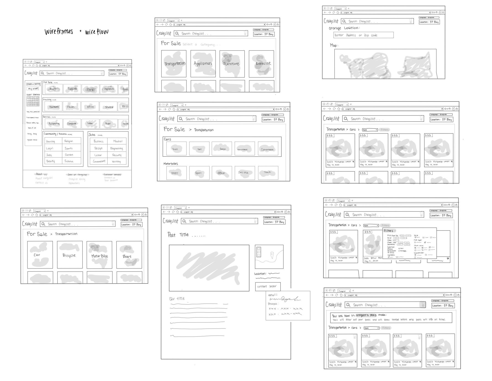
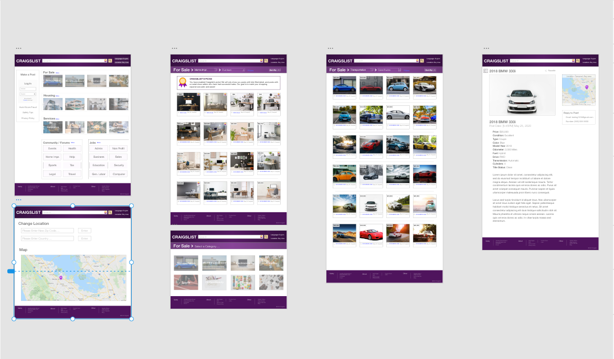
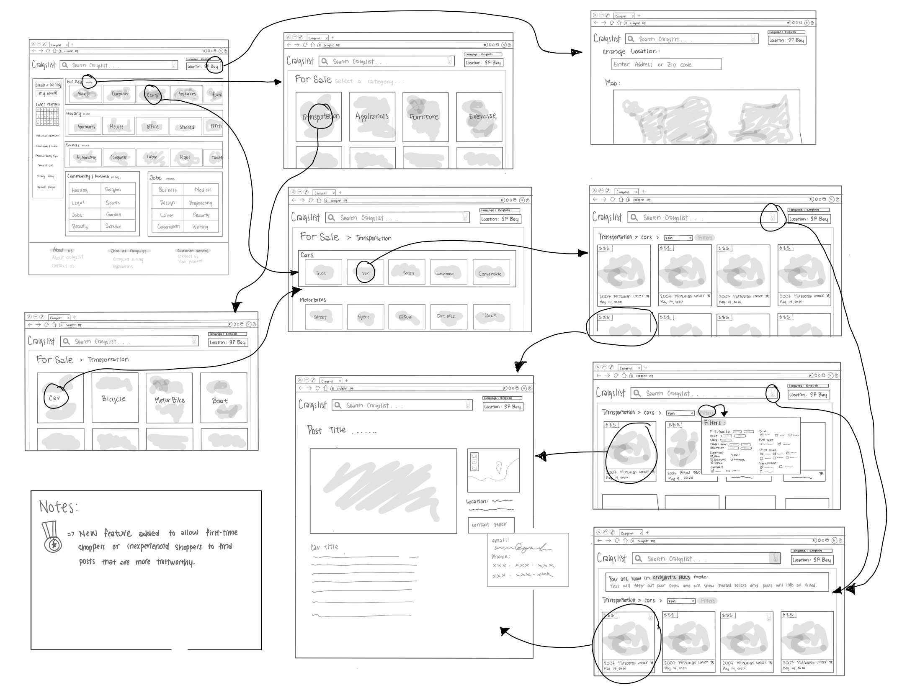

## By Chereen Tam 

### DH150_Final Assignment (Professor Sookie)

### Introduction:

  Technology has tremendously grown over these several decades with increasing amounts of researchers, companies, and scientists that focus solely on developing technological software and devices. As a result, the majority of the world has grown with technological advancements by purchasing and using these devices, such as computers and cell phones. Today, one of the most important aspects of the internet is being able to buy and sell anything online. Online shopping is becoming increasingly popular as more and more people have access to internet connected devices and less time to physically shop in shopping malls. Many physical stores, such as Costco, Walmart, Nike, and many more, have implemented online shopping sites in order to increase their sales. Sites such as Amazon, Facebook, eBay, and Craigslist are widely known sites where companies or individuals can sell and or buy items online. However, there are some sites that are considered as online marketplaces where anyone can sell any item they want. These items in the online market places tend to be used items that people want to sell for a cheaper price. 

  My aim for this project is to improve several features of the online website marketplace, Craigslist. Craigslist is a very popular  web-based service that allows users to sell and buy items, interact with other users, find housing, and apply for jobs. My project will specifically focus on the item searching aspect of the website. With an online marketplace that is flooded with old and new users, the site should be easy to digest and figure out. Therefore, this project will research users and create a prototype that satisfies their needs and experiences when searching for items on this site.  

### Design Statement:

  Currently, the Craigslist site has several issues that I am interested in solving. My main concerns are the design aspect and the safety aspect while looking through the site for posts that interest the user. The current Craigslist site is difficult to digest due to the overwhelming amount of text and the poor design choices. The site seems unreliable and unprofessional and is not intuitive to users. Additionally, there are many categorization issues that need to be solved to improve the functionality of the site. Finally, the safety aspect is important for online marketplaces due to anyone being the seller. Therefore, it is important for the site to implement safety features for new and unfamiliar users to help identify which posts are more trustworthy. 

### Competitor Analysis: Heuristic Evaluation/Usability Testing

The purpose of UT is to uncover any issues with the developmental and design process of the website. UT uses a small sample size that requires the participants to do a detailed test in order for the testers to collect empirical data. These tests are controlled and can be done in a location or remotely. The participants will come from different backgrounds and they are usually asked to perform realistic tasks while using the product. As a result, UT is able to uncover more global usability problems. The goal of usability testing is to inform the design, eliminate frustration, and improve profitability.

**Heuristic Evaluation**

Heuristic evaluations are general points that should be included to create a successful and interactive design within a product. It is important to evaluate the site that the designer is interested in changing to determine the current usability of the site. These ten principles are visibility of system status, match between system and the real world, user control and freedom, consistency and standards, error prevention, recognition rather than recall, flexibility and efficiency of use, aesthetic and minimalist design, help users recognize, diagnose and recover from errors, and help and documentation.

[Continue Reading Heurisitc Evaluations...](https://github.com/chereeny/DH150_Assignment1)

**Usability Testing**

Usability testing tests how functional the interfaces in the product. There are five important quality attributes, learnability, efficiency, memorability, errors, and satisfaction, that need to be considered when testing for usability. By using test users, the usability testing will allow the designers to evaluate and understand the actions and through processes of the users. Ultimately, this will allow designers to identify the weak points of the product’s usability and improve upon them.

[Continue Reading Usability Testing...](https://github.com/chereeny/DH150-Assignment2)

### User Research: 

  User research involves several methods that help the designers understand who their users are, what their actions are, the purpose of your project, and the testers' feedback. This research is conducted through three methods, observation, interviews, and participation.
  
  For this project, I will be using the observation method, specifically ethnographic field research, and participatory research. Through ethnographic field research, I will be able to observe and see how often users use and look through online marketplaces in their daily life. I will also be able to understand and see their process of browsing and finding an item they are interested in. On the other hand, participatory research will allow me to see how well the site functions by asking the user to do a specific task. 

[Continue Reading User Research...](https://github.com/chereeny/-DH150-Assignment4)

### UX Storytelling:

  The purpose of UX storytelling is to communicate a certain product, design, and story to the audience. To do UX storytelling, the creators must think and work from the users perspective in order to understand their behaviors and motivations. By understanding and testing different users, the creators will be able to create a better product that is better for everyone. Ultimately, UX storytelling must be able to fulfill the users needs and goals and deliver the product’s main focus.

  For this project, I have created three different personas to demonstrate the new functions of my new site. Each of these personas are in various stages in life, but they all have a need for an online marketplace to buy used items. 
  
[Continue Reading UX Storytelling...](https://github.com/chereeny/DH150-Assignment5)

### Wireframe and graphic design element variation:

[Continue Reading Wireframing...](https://github.com/chereeny/DH150-Assignment6)

### Low-Fidelity Prototype (Wireflow):

  Low fidelity prototypes are created in order to present a new idea without the tedious work of creating an actual prototype. These low fidelity prototypes are simple and quick to make, allowing designers to easily make changes and add new features. Additionally, wireflows are created in order to demonstrate the functionality and the flow of the new product. These wireflows can be tested in order to identify any issues and to gauge the intuitiveness of the new product. 

  For this project, I have created a hand drawn low fidelity prototype that demonstrates the improved website designs, functions, and safety suggestion features. The wireflow was also created to demonstrate to see if the flow of the site made sense to users. This was then tested by a test user to find the issues and to make further improvements before creating the high fidelity prototype.

[Continue Reading Low-Fidelity Prototype...](https://github.com/chereeny/DH150-Assignment6)

### High-Fidelity Prototype:

  The high fidelity prototype is created after making alterations to the low fidelity prototype. This prototype is created to fully evaluate whether the new idea or new product is feasible. At this stage, the prototype is semi-functionally interactive and can be tested as if clicking through a real site. This will allow the designers to full grasp whether their idea needs to be changed or does not work. 

  In my high fidelity prototype, I have included a newly designed site that is much more usable and intuitive for users. I rearranged and re-categorized the different product categories and functions to declutter the overall site. Finally, I added a function ‘Craigslist's picks’ to aid users in selecting more trustworthy posts. This high fidelity was created and tested to see the overall usability of the site. 

[Prototype Link](https://xd.adobe.com/view/65c01a42-19a9-414c-55ef-66b362ae7e15-13f1/)

[Continue Reading High-Fidelity Prototype...](https://github.com/chereeny/DH150-Assignment7)

### Conclusion:

  Throughout this quarter, I have learned the process of evaluating a site through heuristic evaluation, usability testing, design evaluation, and researching and the steps to creating an interactive prototype that satisfies multiple personas. The process of evaluating the site taught me what aspects of the site, that I have never noticed, were important to create a functional product. Before this class, I never realized how many steps and considerations need to be taken in order to be accessible to all types of people. I learned how to create questions and tests for test users to help me further improve the site and my prototype. From all the testing that we conducted in this class, I realized how much could be improved by having many test users. 
  
  The process I enjoyed the most was creating the low fidelity prototype and learning Adobe XD to create an interactive high fidelity prototype. Through the high fidelity prototyping, I struggled a lot and spent a great deal of time creating a prototype that I am not completely satisfied with. However, this motivates me to do more prototyping in the future to develop more and better prototypes. I would also like to learn more about web design related aspects, such as typography and color, and human behaviors and their interactions on websites. Eventually, I want to be able to build prototypes that have good design principles and further incorporate my design and art background in a functional, accessible, and intuitive product. 
